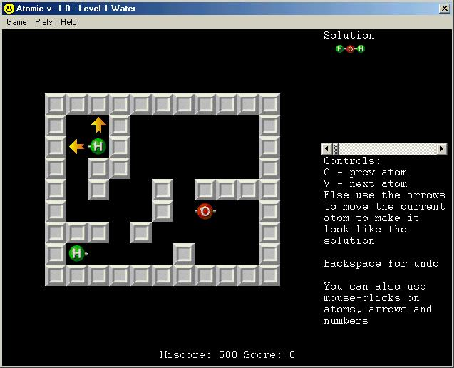



## Atomic

### Description

The KAtomic game for KDE/Linux ported to VB 6. An entertaining puzzle game with a little bit of chemistry on the sly.

Demonstrates the use of flickerfree graphics, embedded graphics and ini-functions. Also uses a class module for the game-routines
 
### More Info
 

             |
---                |---
**Submitted On**   |2003-09-03 08:04:18
**By**             |[Tom Halvorsrod](https://github.com/Planet-Source-Code/PSCIndex/blob/master/ByAuthor/tom-halvorsrod.md)
**Level**          |Intermediate
**User Rating**    |4.7 (14 globes from 3 users)
**Compatibility**  |VB 5\.0, VB 6\.0
**Category**       |[Games](https://github.com/Planet-Source-Code/PSCIndex/blob/master/ByCategory/games__1-38.md)
**World**          |[Visual Basic](https://github.com/Planet-Source-Code/PSCIndex/blob/master/ByWorld/visual-basic.md)
**Archive File**   |[Atomic1649659242003\.zip](https://github.com/Planet-Source-Code/tom-halvorsrod-atomic__1-48754/archive/master.zip)

